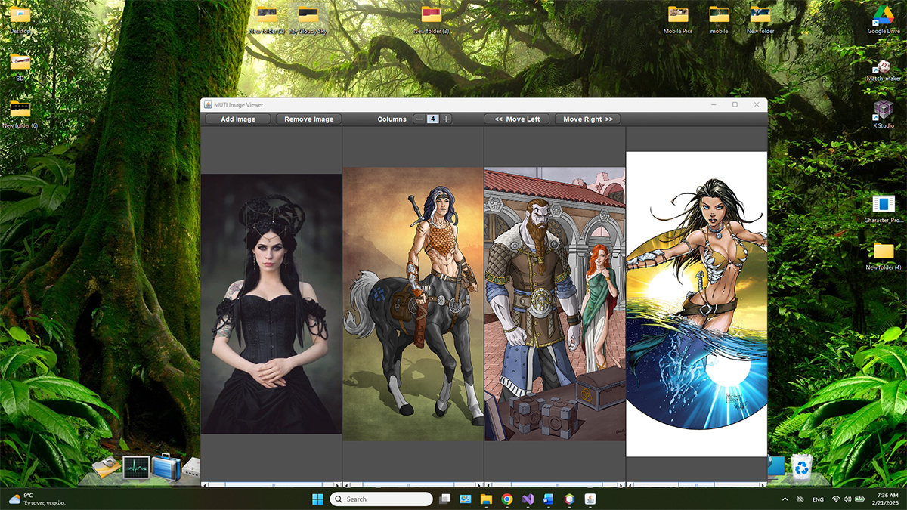
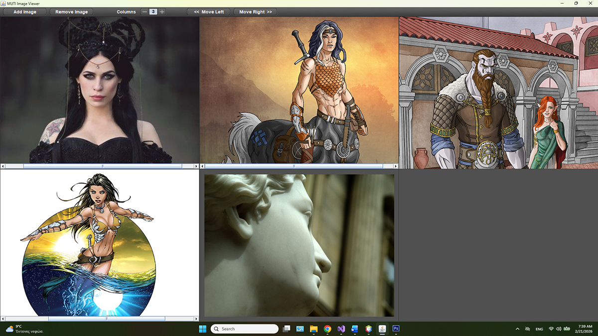

# Multi-Tilling Image Viewer (Muti)

---

## Overview

Muti Image Viewer is a desktop application that allows users to load, arrange, and interact with multiple images simultaneously in a dynamically adaptive grid.

Unlike standard viewers that display one image at a time, this system manages **multiple interactive image panels** with independent zoom behavior and responsive layout recalculation based on window size and column configuration.

The project demonstrates practical software engineering in:

- dynamic UI layout computation
- stateful component management
- scalable rendering strategies
- interaction architecture
- performance-aware image handling

---
## Screenshots

Viewer in normal window:  

Viewer maximized with multiple images:  

---

## Key Features

- Dynamic multi-tile image grid

- Real-time layout adaptation during window resize

- Resolution-aware scaling across different displays

- Native system file dialog integration

- Lightweight runtime footprint

- Modular UI logic for maintainability

- Designed for predictable behavior across Windows environments

---

# Engineering Highlights

---

## Resolution-Adaptive Layout Engine

**Layout scaling is derived from the actual runtime environment** rather than fixed design assumptions.
This prevents visual drift across monitors, and window states.

## Container-Driven Scaling Model

UI behavior is based on usable content area instead of raw screen resolution.
This ensures consistency between normal and maximized window states.

## Performance-Oriented Rendering Approach

- Rendering workload scales only with active content

- Layout recalculation occurs only when necessary

- No unnecessary processing during idle UI states

## Platform-Aware UI Behavior

- The application accounts for real-world desktop constraints including:

- Window decorations and insets

- OS-native dialog behavior

## Technical Challenges

- Efficient Image Scaling via Caching to reducing CPU usage and improving UI responsiveness during window resizing.

- Preventing layout drift from window decoration differences

- Ensuring consistent rendering across HD and 4K displays

---

# System Requirements

- Windows 10 or Windows 11 (Recomended)

- Java Runtime Environment (JRE), 64-bit

No development tools or JDK installation is required.

---

## Java Runtime Installation

To run the application, install a Java Runtime Environment.

**Recommended download:** Java for Desktops (Windows x64)

https://www.java.com/en/download/

**Download steps:**

1. Open the website

2. Download Java for Desktops

3. Install normally

After installation, the application will run immediately.

## Running the Application
Run executable

1. Install Java Runtime

2. Launch: Muti Image Viewer.exe

---

# Technology Overview

- Desktop UI built with Java

- Native OS file dialog integration

- Resolution-adaptive layout system

---

## Project Purpose

- This project demonstrates practical desktop software engineering skills:

- Designing UI systems that behave correctly across environments

- Managing resolution variability

- Building responsive desktop interfaces

- Structuring UI logic for predictability and maintainability

- Handling platform-specific behavior in real-world conditions
